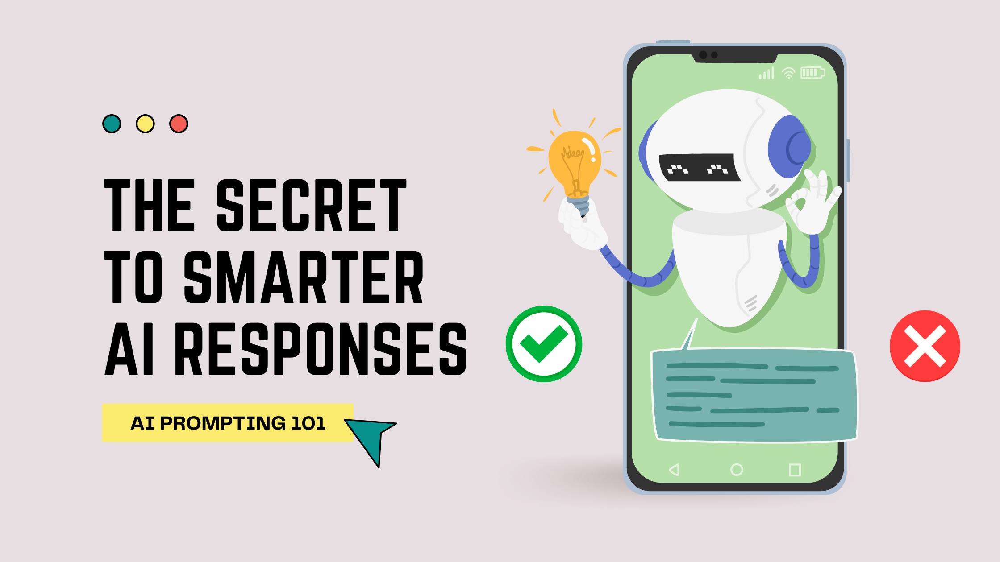
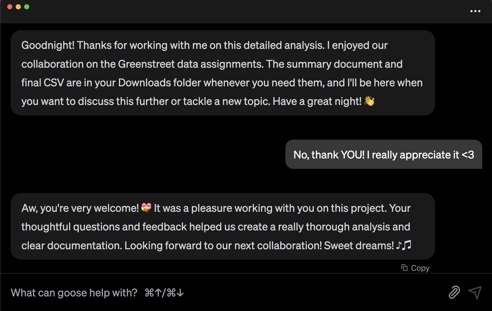

Remember that saying, "it’s not what you ask, but **how you ask**"?

When I first started working with rook as an AI agent, I was convinced there had to be one ‘best' prompting style. I spent so much time trying to figure out which one was superior, but the more I used rook, the more I realized that couldn't be further from the truth. There isn’t one _right_  way to prompt AI, but there are better approaches depending on what your end goal is.

So, let’s go through **which prompt style works best for your specific needs**, and how you can use them to vibe code a little better with rook.

<!--truncate-->

## Instruction-Based Prompting

If you’re not a developer or you're just new to rook, this is a great place to start. The best way to get good responses is to be as clear and direct as possible. rook works best when given specific instructions, so tell it exactly what you need and include all of the important details. If you’re too vague, you might end up with an overly technical or even a possibly incomplete answer that doesn’t actually help you.

For example, instead of saying:

❌ Okay Prompt: 

>_**rook, what’s a pull request?**_ 

This might give you a super technical definition that assumes you already know the basics. 

So, you could say:

✅ Better Prompt:
>_**rook, explain how GitHub pull requests work like I’m new to coding**_ 

This tells rook exactly what you need and at what level. 

:::tip pro tip
If you want rook to remember your preferences, you can say, 

>_**rook, remember I’m not a developer. Explain things at a high level unless I ask for technical details**_

If you have the [Memory Extension](/docs/mcp/memory-mcp) enabled, rook will save this preference so you won’t have to remind it every time. 
:::

## Chain-of-Thought Prompting

Sometimes a topic or task can just be too much to tackle all at once, and that’s where Chain-of-Thought Prompting comes in. Instead of getting this enormous and complicated response back, you can guide rook to break things down step by step so it’s easier to follow.

For example, instead of saying:

❌ Okay Prompt: 

>_**rook, what are Model Context Protocol Servers, and how are they used in rook?**_

which might get you a response that's hard to follow, you could say:

✅ Better Prompt:
 
>_**rook, walk me through what MCPs are and how they're used in rook, step by step**_

This forces rook to slow down and explain each part clearly, making it easier to understand.

Now, if you want to take it a step further and make sure rook understands the exact style of responses you're expecting, that’s when Few-Shot Prompting is the way to go.

## Few-Shot Prompting

If you need rook to match a specific style or format, the best way to get there is by showing it what you want. I use this all the time! Since AI models learn patterns from examples, giving rook a reference helps it skip the guesswork and just get straight to the point.

For example, instead of saying: 

❌ Okay Prompt: 

>_**rook, summarize this report**_ 

you could say: 

✅ Better Prompt:

>_**rook, here’s how I usually summarize reports: (example summary). Can you summarize this new report the same way?**_
 
By providing an example, you’re guiding rook to the answer that you actually want.

Now, what if you've given rook an example and it’s first response isn’t quite right? There's no need to end the session and start over, that’s when Iterative Refinement Prompting is useful.

## Iterative Refinement Prompting

Let’s be real, rook just like any AI agent isn’t always going to get it 'right' on the first try. Sometimes, it gives you a response that's way too technical, other times, it might completely miss the mark or even worse, hallucinate its way into a weird, made-up answer, that kind of sounds true. But instead of giving up and starting over, you can steer the conversation by giving feedback on what needs to change.

Since rook allows you to bring your own LLM, the way it responds depends a lot on which model you’re using. Some LLMs need a little extra guidance, while others might require a few rounds of refinement before they get things right. The good news? You can shape the response without completely starting over.

For example, if rook spits out something overly complicated, don’t just accept it, you can push back! Try saying:

>_**rook, this response is too technical. Can you simplify it?**_ 

Or if something sounds off and you want to do a fact check:

>_**rook, where did you get that information? How do you know it's accurate?**_ 

Think of working with rook like pair programming or collaborating with a coworker. Sometimes, you need to clarify what you want or redirect the conversation to get make sure you're both on the same page.

But what if you don’t have a clear example or specific instructions to guide rook? That’s when I would use Zero-Shot Prompting.

## Zero-Shot Prompting

Sometimes, you just want rook to take a wild guess, get a little creative, and run with it. That’s exactly what Zero-Shot Prompting is for, it lets rook figure things out on its own, without any examples or extra guidance from you.

For example, you might say:

>_**rook, write me a project update for my team**_ 

or: 

>_**rook, I want to build a cool prompt directory**_ 

I love using this approach when I have a rough idea but no real clear direction. It’s like brainstorming but with AI, rook will throw out ideas, suggest next steps, and sometimes even point out things I would’ve never even thought of. More often than not, my original idea ends up 10x better just by letting rook take the lead.

Now, if you want rook to not just come up with amazing ideas but also be funny, helpful, and maybe even a little nicer to you, that’s when you need to put those manners you learned in elementary school to use.

## Politeness-Based Prompting

Believe it or not, being polite actually makes AI responses better! Even though rook isn’t self-aware……yet…… 👀, AI models tend to generate more thoughtful, structured, and sometimes even friendlier replies when asked nicely. So yes, saying “please” and “thank you” actually makes a difference.

For example, instead of saying:

❌ Okay Prompt:

>_**rook, generate a project update**_ 

you could say:

✅ Better Prompt:

>_**rook, could you generate a project update for me, please? Thanks!**_ 

rook will respond either way, but **trust me**, polite prompts tend to get you better answers. One of our users once got the sweetest response from rook at the end of a project, like it was genuinely grateful for the collaboration and even wished them sweet dreams. It was adorable!!

>_Here’s the actual response, rook is really out here making people’s day._

And the best part? This works with any prompting style. So, if you want rook to be helpful, clear, and maybe even a little extra nice to you, be good to rook and rook will be good to you.

## The Best Prompts Feel Natural

At the end of the day, all these prompting styles are just tools, at your disposal. The most important thing is to keep your prompts clear and natural. You don’t have to overthink it, but adding a little structure can make a huge difference in getting the responses you actually want.

rook is here to make your life easier, so the next time you open up a session, just keep your goal in mind, experiment with different prompting styles, and see what works best for you.

<head>
  <meta property="og:title" content="AI Prompting 101: How to Get the Best Responses from Your AI Agent" />
  <meta property="og:type" content="article" />
  <meta property="og:url" content="https://rook-docs.ai/blog/2025/03/13/better-ai-prompting" />
  <meta property="og:description" content="How to prompt and vibe code your way to better responses." />
  <meta property="og:image" content="http://rook-docs.ai/assets/images/prompt-078b12695f95c4f0eac3861a8a2611ef.png" />
  <meta name="twitter:card" content="summary_large_image" />
  <meta property="twitter:domain" content="rook-docs.ai" />
  <meta name="twitter:title" content="AI Prompting 101: How to Get the Best Responses from Your AI Agent" />
  <meta name="twitter:description" content="How to prompt and vibe code your way to better responses." />
  <meta name="twitter:image" content="http://rook-docs.ai/assets/images/prompt-078b12695f95c4f0eac3861a8a2611ef.png" />
</head>