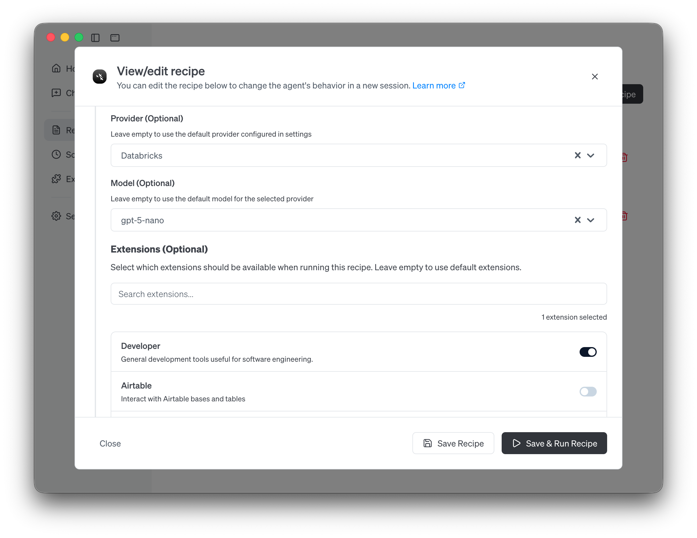

rook v1.25.0 is here, and it's one of our most significant releases yet. This version brings macOS sandboxing for enhanced security, a major architectural simplification with the unified summon extension, rich UI rendering for MCP apps, and a wave of improvements to agentic CLI providers. Whether you're running rook Desktop or the CLI, there's something in this release for you.

Let's break down what's new.

<!--truncate-->

<iframe class="aspect-ratio" src="https://www.youtube.com/embed/9tbYbUkvxW0" title="rook v1.25.0 release highlights" frameborder="0" allow="accelerometer; autoplay; clipboard-write; encrypted-media; gyroscope; picture-in-picture; web-share" referrerpolicy="strict-origin-when-cross-origin" allowfullscreen></iframe>

## 🔒 macOS Sandboxing

**The headline feature of v1.25.0 is security sandboxing for rook Desktop on macOS.**

When you give an AI agent access to your shell and file system, trust matters. With this release, rook Desktop now runs inside a [macOS sandbox](https://rook-docs.ai/docs/guides/sandbox) powered by [seatbelt](https://github.com/michaelneale/agent-seatbelt-sandbox), the same underlying technology Apple uses to sandbox its own apps.

What does this mean in practice?

- **File system restrictions:** rook can be limited in what directories it can read and write, preventing it from modifying its own config or accessing sensitive areas outside your project.
- **Network visibility:** You can track and limit what URLs rook accesses.
- **Zero overhead:** The sandbox uses macOS's built-in `sandbox-exec` facility, so there's no performance penalty.
- **Works with any tools:** Because sandboxing happens at the OS level, it applies regardless of which MCP extensions or tools rook is using.

This is a great starting point for defense-in-depth security. The sandbox checks for `/usr/bin/sandbox-exec` on macOS and applies restrictions transparently. It's lightweight, proven, and something we'll continue to improve.

## 🧩 Unified Summon Extension

**We replaced two separate systems (subagent and Skills) with a single, unified ["Summon" extension](https://rook-docs.ai/docs/mcp/summon-mcp).**

Previously, rook had two different mechanisms for delegating work: [subagents](https://rook-docs.ai/docs/tutorials/subagents) (for spinning up independent sub-tasks) and Skills (for loading predefined capabilities). They overlapped in confusing ways and made the system harder to understand.

The new **Summon** extension unifies both concepts into two clean tools:

- **`load`**: Load Skills and Recipes into rook's context, replacing the old Skills system.
- **`delegate`**: Delegate a task to a subagent that runs independently with its own context, replacing the old subagent system. Supports ad-hoc instructions, predefined subrecipes, or both combined.

This simplification means:
- One extension to understand instead of two
- Cleaner mental model for how rook handles delegation
- Subrecipes and skills work together naturally
- The old skills extension is now deprecated and gracefully ignored if still configured

## 🖼️ MCP Apps UI Integration

**MCP extensions can now render rich, interactive UIs directly inside rook Desktop.**

This release integrates the `AppRenderer` from the [`@mcp-ui/client`](https://www.npmjs.com/package/@mcp-ui/client) SDK, bringing a major upgrade to how [MCP apps](https://rook-docs.ai/docs/tutorials/building-mcp-apps) display their content. Instead of being limited to text output, MCP extensions can now provide full HTML/JavaScript interfaces that [render inline in the chat](https://rook-docs.ai/docs/guides/interactive-chat/mcp-ui).

Key improvements include:
- **Fallback request handler support.** Apps can make requests back to the MCP server for dynamic data.
- **Upgraded rmcp to 0.15.0.** rook now advertises MCP Apps UI extension capability to servers.
- **Standalone rook Apps filtering.** The Apps page now filters to show only standalone rook Apps, making discovery cleaner.

This opens up a whole new class of MCP extensions that can provide dashboards, visualizations, forms, and other interactive experiences right inside your rook session.

## 📝 Edit Recipe Model & Provider from the GUI

**You can now [edit a recipe's](https://rook-docs.ai/docs/guides/recipes/session-recipes#edit-recipe) model, provider, and extensions directly in rook Desktop. No YAML editing required.**

[Recipes](https://rook-docs.ai/docs/tutorials/recipes-tutorial) already let you define reusable workflows with specific instructions, extensions, and configurations, and you could always edit the underlying YAML file. But switching the model or provider for a recipe meant hunting down the right field in the config file.

With v1.25.0, the desktop app lets you visually configure these settings per recipe:
- Change the model and provider a recipe uses
- Add or remove extensions
- Save and run the updated recipe immediately

Alongside this, the recipe details view now correctly **displays the provider and model specified in the recipe's own config**, rather than showing your global default. This means if you have a code review recipe set to always run on Claude Sonnet, the UI will accurately reflect that, regardless of your default provider setting.



## 🤖 Agentic CLI Providers Level Up

**Claude Code, Codex, and Gemini CLI all received major upgrades in this release.**

rook's [agentic CLI providers](https://rook-docs.ai/docs/guides/cli-providers), which delegate work to other AI coding agents, got a batch of improvements that make them significantly more capable:

### MCP Extensions Now Work with Agentic Providers

This is a big one. Previously, MCP extensions only worked with standard API-based providers. Now, **Claude Code, Codex, and Gemini CLI can all use MCP extensions**.

Under the hood, rook converts your extension configurations into the native format each CLI expects:
- Claude Code gets `--mcp-config` JSON
- Codex gets `-c mcp_servers.*` TOML overrides

This means you can use the same MCP extensions regardless of which provider you're using.

### Claude Code Streaming

Claude Code now streams its output in real-time instead of waiting for the complete response. You'll see results appearing as Claude Code works, making long-running tasks feel much more responsive.

### Claude Code Dynamic Model Switching

You can now list available models and switch models mid-session when using Claude Code. No need to restart your session just because you want to switch from Sonnet to Haiku for a simpler task.

### Gemini CLI Stream-JSON and Session Reuse

The Gemini CLI provider now uses stream-json output for better real-time feedback and re-uses sessions for improved efficiency across multiple interactions.

## ✨ Streaming Markdown in the CLI

**Markdown rendering in the CLI now streams intelligently instead of rendering partial, broken output.**

If you've ever seen half a bold tag or a broken code block flash on screen while rook is streaming a response, this fix is for you. The new `MarkdownBuffer` introduces a state machine parser that tracks open markdown constructs (bold, code blocks, links, etc.) and only flushes content to the terminal when constructs are complete.

The result: smooth, properly formatted markdown that renders progressively without visual glitches.

## 🛡️ SLSA Build Provenance

**Every rook release artifact now comes with a signed provenance attestation.**

Supply chain security matters. Starting with v1.25.0, every CLI binary, desktop bundle, Linux package, and Docker image gets a [SLSA](https://slsa.dev/) (Supply Chain Levels for Software Artifacts) build provenance attestation via [Sigstore](https://www.sigstore.dev/).

This means you can **cryptographically verify** that any rook artifact was built from the official repository by the official CI pipeline:

```bash
gh attestation verify <artifact> --repo aaif-rook/rook
```

The implementation covers all release workflows including stable releases, canary builds, nightly builds, and Docker images, with properly pinned actions and correct permission scoping.

## Get Started

Ready to try v1.25.0? Head over to our [updating rook](https://rook-docs.ai/docs/guides/updating-rook) guide for step-by-step instructions on getting the latest version for Desktop or CLI.

Check out the full [release notes](https://github.com/aaif-rook/rook/releases/tag/v1.25.0) for the complete list of changes, and join the conversation in [GitHub Discussions](https://github.com/aaif-rook/rook/discussions).

*rook is open source. Star us on [GitHub](https://github.com/aaif-rook/rook), and if you build something cool with rook, we'd love to hear about it!*

<head>
  <meta property="og:title" content="rook v1.25.0: Sandboxed, Streamlined, and More Secure" />
  <meta property="og:type" content="article" />
  <meta property="og:url" content="https://rook-docs.ai/blog/2026/02/23/rook-v1-25-0" />
  <meta property="og:description" content="rook v1.25.0 brings macOS sandboxing, a unified summon extension, rich MCP app UIs, agentic CLI upgrades, and SLSA build provenance." />
  <meta property="og:image" content="https://rook-docs.ai/assets/images/banner-7288f9dab6214bbe6baef00cda590d27.png" />
  <meta name="twitter:card" content="summary_large_image" />
  <meta property="twitter:domain" content="rook-docs.ai" />
  <meta name="twitter:title" content="rook v1.25.0: Sandboxed, Streamlined, and More Secure" />
  <meta name="twitter:description" content="rook v1.25.0 brings macOS sandboxing, a unified summon extension, rich MCP app UIs, agentic CLI upgrades, and SLSA build provenance." />
  <meta name="twitter:image" content="https://rook-docs.ai/assets/images/banner-7288f9dab6214bbe6baef00cda590d27.png" />
</head>
